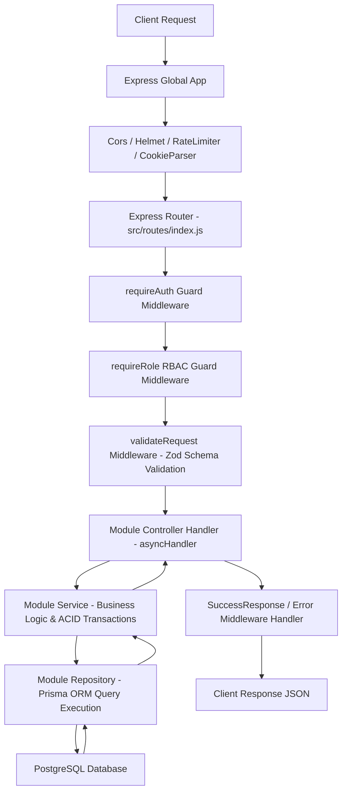

# HireQuest Backend - Architecture & Design System

## Executive Overview

HireQuest Backend is engineered as an **Enterprise Cognitive Assessment Platform** powered by Node.js, Express, Prisma ORM, and PostgreSQL. 

The architecture strictly follows the **100% Zero-Subfolder Pure Modular Option A Standard**, guaranteeing ultra-clean code separation, zero subfolder complexity inside domain modules, high maintainability, and enterprise-grade performance.

---

## 1. Domain Module Layout Standard (100% Zero-Subfolder Option A)

Every domain module under `src/modules/<module_name>/` contains **EXACTLY 0 SUBDIRECTORIES** and strictly 8 to 10 flat root files:

```text
src/modules/<module_name>/
├── <module>.constants.js    # Domain limits, error codes & success messages
├── <module>.controller.js   # Express HTTP Handler functions (Wrapped in asyncHandler)
├── <module>.dto.js          # Response DTO transformers & client sanitizers
├── <module>.mapper.js       # Request payload & database entity mapping
├── <module>.repository.js   # Prisma DB queries (Supports ACID transactions via tx client)
├── <module>.routes.js       # Express Router endpoint declarations
├── <module>.service.js      # Domain Business Logic & ACID Transactions (Single Class)
├── <module>.validator.js    # Zod Validation Schemas & Refinement rules
└── index.js                 # Central Module Exporter Facade
```

### Module Audit Matrix
- ✅ `src/modules/assessment/` (0 Subdirectories, 9 Root Files)
- ✅ `src/modules/auth/` (0 Subdirectories, 10 Root Files)
- ✅ `src/modules/category/` (0 Subdirectories, 9 Root Files)
- ✅ `src/modules/question/` (0 Subdirectories, 9 Root Files)
- ✅ `src/modules/tag/` (0 Subdirectories, 9 Root Files)

---

## 2. Request Handling Pipeline & Data Flow

When an HTTP request enters the backend, it traverses a deterministic pipeline:



---

## 3. Global Infrastructure Components

### 3.1 Common Abstractions (`src/common/`)
- `errors.js`: Unified HTTP Exception Hierarchy (`AppError`, `BadRequestError`, `UnauthorizedError`, `ForbiddenError`, `NotFoundError`, `ConflictError`).
- `response.js`: Standardized API Success Response helper (`SuccessResponse.send`).
- `transaction.js`: Transaction runner helper (`runTransaction`) ensuring clean rollback on database operations.

### 3.2 Global Middlewares (`src/middleware/`)
- `asyncHandler.js`: Higher-order function eliminating `try/catch` boilerplate in Express handlers.
- `error.middleware.js`: Global error handler converting Prisma errors, Zod validation errors, JWT errors, and AppErrors into standard `{ success: false, error: { code, message, details } }`.
- `requireAuth.js`: JWT Bearer Token verification guard.
- `requireRole.js`: Role-based access control guard (RBAC).
- `validateRequest.js`: Request payload validation middleware.

---

## 4. Security & Authentication Architecture

1. **Dual-Token System**:
   - **Access Token**: Short-lived JWT (15-60 mins) passed via `Authorization: Bearer <token>` header.
   - **Refresh Token**: Long-lived JWT (7 days) stored in `HTTP-Only`, `SameSite=Lax` secure browser cookie.
2. **Session Revocation**:
   - Refresh tokens are hashed and stored in PostgreSQL (`RefreshToken` table).
   - Single-click global logout (`logoutAllDevices`) increments `user.tokenVersion`, instantly invalidating all active sessions.
3. **Password Hashing**:
   - Passwords hashed using `bcryptjs` with salt rounds = 12.

---

## 5. Automated Verification & Quality Assurance

The codebase is enforced by a comprehensive **Node.js Native Automated Test Suite**:

- **Command**: `npm test`
- **Total Tests**: **46 / 46 Passing (0 Failures)**
- **Execution Time**: ~1.7 Seconds 🚀
